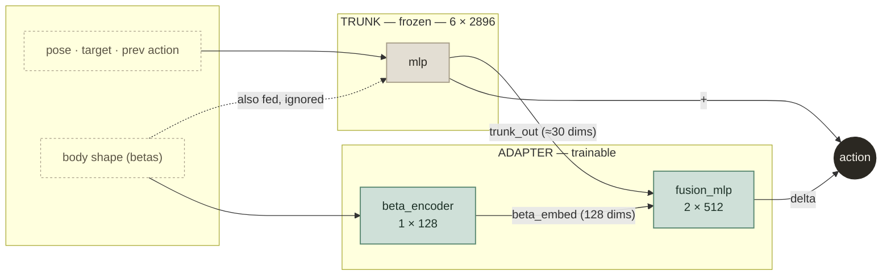
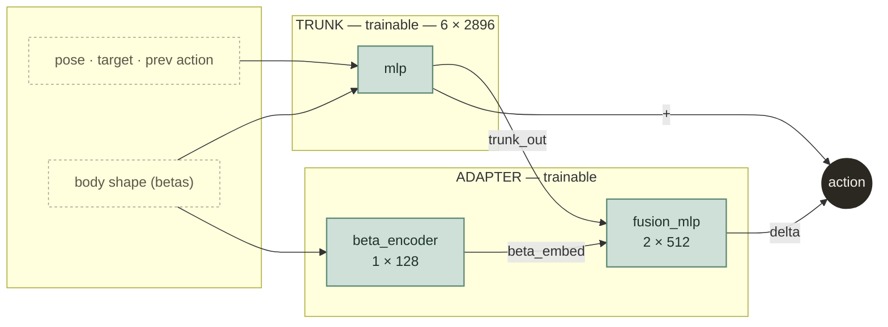

# Stage 2 fusion adapter: why it plateaus, and the unfreeze plan

Companion diagram for `note/README.note.md` §39. Hosted version (same content):
https://claude.ai/code/artifact/09f51cb2-c1f2-43da-8d80-c0ab1083a64f (private by default).

`hhi_wide_fusion_stage2_clippool` (wandb `8reyx4ci` / `c9xvetac`) plateaus below 70% success
rate — clearly behind the earlier full-concat adapter run (`3skv3b2g`, ~78%), even though the
two adapters are close in size. The gap isn't capacity. It's what each piece is allowed to see.

## Current structure (frozen trunk)

**The bottleneck:** `fusion_mlp` never sees the pose or the target directly — only the trunk's
already-decided ~30-number action, plus a shape embedding. It can nudge *what the trunk already
concluded*, but can't reason from *why* a correction is needed. And the trunk itself, despite
having `morphology_obs` wired into its input the whole time, never learned to use it — Stage 1
only ever trained it on one body. Freezing it locks that blind spot in permanently. No adapter
bolted on afterward, however shaped, can fix that from the outside.

## Proposed structure (unfrozen)

Same wiring, one change: the trunk's weights are no longer locked. It's warm-started from
`8reyx4ci`'s own checkpoint — not from scratch — so the adapter's partially-learned correction
carries over, and the trunk gets its first real chance to fold shape-conditioning into its own
6 layers instead of leaving all of it to a downstream patch working with limited information.

## What actually changes

| | Frozen (current) | Unfrozen (proposed) |
|---|---|---|
| Trunk weights | locked at Stage 1 values | trainable |
| Trunk's obs normalizer | pinned to Stage-1 stats | adapts to full 128-shape spread |
| `beta_encoder` / `fusion_mlp` | trainable | trainable (unchanged) |
| Warm start | Stage 1 checkpoint | `8reyx4ci`'s own checkpoint |
| Optimizer | — | same one, no rebuild needed — it already tracks every param |
| Experiment name | `hhi_wide_fusion_stage2_clippool` | `hhi_wide_fusion_stage2_unfrozen` (new — resuming the old name would silently reload the frozen config) |

## Watch on launch

`actor_optimizer.lr` stays at `4e-6` to start — previously a safe rate for a small adapter,
now steering the whole trunk too. Over the first ~1–2k epochs:

- **`clip_frac` near zero** → updates too small, trunk barely moving → LR needs raising.
- **`success_rate` or jerk regress sharply below the 8reyx4ci plateau** → LR too aggressive,
  overwriting the motion-tracking skill freezing was there to protect.

## Status update (2026-07-28)

This plan was carried out: `hhi_wide_fusion_stage2_unfrozen` launched, warm-started from
`hhi_wide_fusion_stage2_clippool/last.ckpt`. First checkpoint measured 569MB, matching the
predicted ~595MB for a fully-trainable trunk + reinstated optimizer state (vs. the frozen
version's 225MB, which carried no trunk optimizer state). Full detail, including the
checkpoint-size verification, in `note/README.note.md` §39.
