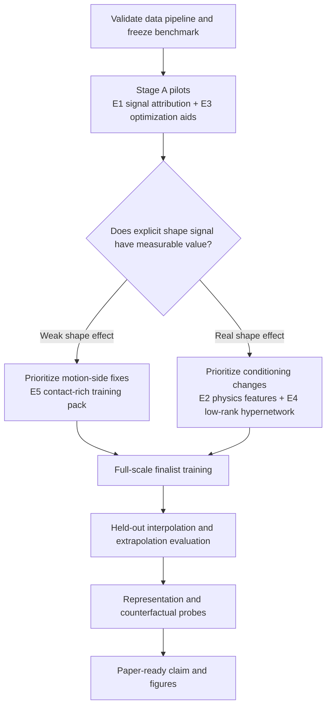
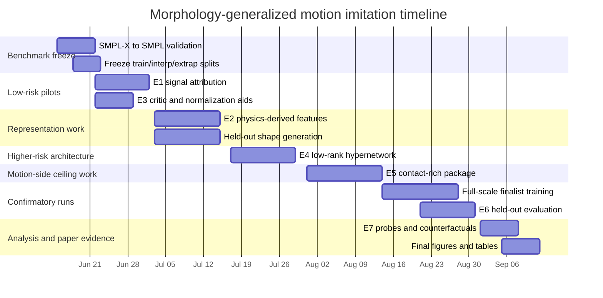

# Experimental Research Plan for Morphology-Generalized Physics-Based Motion Imitation

## Executive summary

The project, as specified in the two uploaded files, is to train a **single physics-based humanoid PPO controller** in IsaacGym that imitates AMASS/HUMOS motions across **128 SMPL body shapes** using a fixed-topology **69-DOF SMPL body**, with current evidence that a raw morphology concatenation baseline and a small learned shape embedding both plateau around **0.85 reward**, while a FiLM-conditioned model fails around **0.72**. The training corpus for the pilot setting is **1024 motion clips × 128 shapes = 131,072 motion-shape trajectories**, and the most salient current failure mode is **squat/crawl and other floor-contact-heavy motions**, not simple locomotion. The explicit paper goal is not text-to-motion or distillation, but a **shape-adaptive physical controller** whose behavior changes meaningfully with morphology. fileciteturn2file0 fileciteturn2file1

The literatura makes the present result **plausible rather than surprising**. In morphology-generalized control, explicit morphology conditioning helps most when morphology changes the **topology or dimensionality** of the body, or when conditioning is injected using **physically aligned module-wise representations** or **parameter-efficient hypernetworks**. In contrast, in fixed-topology settings, richer morphology encoders do not automatically help: Kurin et al.’s *Amorpheus* reported that morphology information encoded in graph structure did **not** improve performance in their ablations, and their morphology-agnostic transformer outperformed morphology-structured GNN baselines; PHC’s multi-shape-capable setup uses **simple limb-length/body-shape inputs** rather than a large learned morphology branch; and recent morphology-transfer work on quadrupeds shows gains from **explicit physical-property conditioning**, not necessarily from bigger generic embeddings. citeturn45academia2turn10view0turn3academia3turn29view1turn32academia2

My highest-confidence interpretation is therefore: **motion difficulty is a primary bottleneck**, **optimization competition across 1024 clips is a second bottleneck**, and **morphology representation capacity is probably not the main bottleneck**. Put differently, hypotheses **(a)** and **(c)** from the prompt look more likely than a pure version of **(b)**, although partial redundancy of shape information with the existing observation stream is also highly plausible because the controller already sees shape-matched target poses and rich proprioception under a fixed SMPL topology. fileciteturn2file1 fileciteturn2file0 citeturn10view0turn11academia2turn24academia0

The most actionable recommendation is to **front-load inexpensive causal ablations** before investing in new architectures: first test whether shape information matters at all once motion diversity is controlled; then test whether **physics-derived morphology features** beat raw betas; then test **critic-only privileged conditioning and per-shape normalization**; and only then invest in a **low-rank hypernetwork / LoRA-style conditioning** experiment. In parallel, the most promising route to move past the 0.85 ceiling is a **contact-rich motion package**: adaptive sampling of hard floor-contact motions, floor-aware RSI, and only then targeted tests of residual-reference action parameterization and contact/phase cues. fileciteturn2file1 fileciteturn2file0 citeturn3academia3turn15academia3turn40academia0turn40academia1turn24academia2

Two findings from the literature directly contradict assumptions that appear in the prompt and should change the experimental order. First, the PHC paper explicitly states that its action parameterization is **different from residual action representations added to the reference pose**; it does **not** use the residual-reference PD formulation attributed to it in the prompt. Second, in the PHC method text the motion-tracking reward is described as **task tracking + AMP style reward + energy penalty**; I did not find an explicit contact reward in that core formulation. These contradictions matter because they weaken the case for simply “copying PHC” on those two dimensions. citeturn10view0

## Extracted aims, hypotheses, constraints, and success criteria

The documents specify a clear scientific aim but leave several operational details open. The table below separates what is explicit from what is still unspecified and therefore must be fixed before running confirmatory experiments. fileciteturn2file0 fileciteturn2file1

| Category | Explicitly specified in files | Unspecified or incomplete | Recommended operationalization |
|---|---|---|---|
| Core scientific aim | One shared physics-based humanoid controller should generalize across many SMPL body morphologies while remaining physically stable and shape-adaptive. fileciteturn2file0 | None | Keep as the primary paper claim. |
| Immediate empirical problem | Raw concat and shape-embed are nearly identical (~0.85), FiLM fails (~0.72), and difficult motions are squat/crawl/floor-contact cases. fileciteturn2file1 | Exact convergence criterion is unspecified | Define a fixed training budget and fixed evaluation benchmark before any new run. |
| Main hypotheses to discriminate | (a) raw betas already sufficient, (b) shape partially redundant with proprioception, (c) motion variance swamps shape variance. fileciteturn2file1 | Relative prior probability of each hypothesis | Use a staged causal ablation that directly isolates signal value and gradient competition. |
| Architecture candidates | Hypernetworks/LoRA, physics-derived features, critic-only conditioning, per-shape normalization, morphology-adaptive initialization. fileciteturn2file1 | Rank, layer placement, feature set, normalization granularity | Use low-rank/bias-only hypernetworks, physically interpretable features, and grouped normalization first. |
| Data regime | 1024 pilot clips from the 5th–55th difficulty percentile, 128 shapes, fixed shape per environment, shape-matched motion sampling only. fileciteturn2file0 | Motion taxonomy for “squat/crawl/contact-rich” subset | Derive a floor-contact taxonomy using root height, contact flags, and manual validation on a small sample. |
| Observation regime | Main observation is large (~1000+ dims combined) while morphology context is just 11 dims. fileciteturn2file1 fileciteturn2file0 | Whether observation normalization is currently shape-aware | Add this as a dedicated ablation. |
| Compute/infrastructure | 4×A40 runs, multi-GPU training, current throughput ~2.7M samples/hour for non-FiLM, evaluator subsamples large datasets. fileciteturn2file0 | Exact budget ceiling in wall-clock, GPU-hours, and money | Plan in **A40-GPU-days** and stage-gate experiments. |
| Near-term evaluation priority | Per-shape variance and worst-case degradation matter more than mean body distance alone; held-out interpolation and extrapolation shapes are planned. fileciteturn2file0 | Formal paper acceptance criteria | Use train-shape, interpolation, and extrapolation benchmarks as the three main axes of evaluation. |
| Paper scope | Simulation-first ICRA 2027 paper; text-to-motion, diffusion, distillation, and Kimodo integration are out of scope. fileciteturn2file0 | Hardware validation | Treat hardware/lab validation as optional and not on the critical path. |
| Pipeline risk | HUMOS was trained on SMPL-X and the files explicitly note that SMPL-X → SMPL conversion remains a TODO to verify. fileciteturn2file0 | Quantitative validation of conversion correctness | Make conversion validation the first pilot gate. |

The documents do not define quantitative success thresholds, so they should be fixed now. I recommend three levels. **Architecture success** means statistically reliable improvement over raw concat on train shapes without worse stability. **Scientific success** means improved **held-out interpolation** and more graceful degradation under **shape extrapolation**. **Paper success** means the best model also yields convincing mechanism evidence: either identifiable morphology representations in the policy or clear causal differences in torque/contact adaptation across shapes. For RL comparisons, because few-seed evaluations are notoriously noisy, use **3 seeds for pilots and 5 seeds for confirmatory claims**, and report interval estimates rather than point means alone. fileciteturn2file0 fileciteturn2file1 citeturn24academia0turn24academia1turn24academia2

## Literature synthesis and implications

**Why concat and shape-embed are likely identical.** In your setup, morphology changes **continuous physical parameters** but not the **topology** of the controller: the body remains a 69-DOF SMPL humanoid, the action/state dimensionality does not vary, environments are assigned a fixed morphology, and the motion library is sampled only from the matching-shape bucket. That reduces the need for the kinds of module-wise structural inductive biases used by SMP, MetaMorph, or graph/transformer universal controllers, which were largely designed for heterogeneous robots with changing action/state structure. In a fixed-topology setting, raw continuous inputs can already be sufficient if the trunk is large enough and if the conditioning signal is smooth. This is also consistent with PHC’s note that when body shapes are used, the controller can consume **limb-length/body-shape information** rather than an elaborate learned morphology pathway. fileciteturn2file0 fileciteturn2file1 citeturn30view0turn29view1turn29view0turn10view0

**There is also real literature support for the possibility that more morphology structure does not help.** The most direct contradiction to the intuition that “better morphology encoding should help” comes from Kurin et al.’s *My Body is a Cage*, where ablations found that morphology information encoded in graph structure did **not** improve performance in graph-based incompatible control, and their **Amorpheus** transformer, which ignores that morphology graph structure, outperformed the graph-based alternatives. I would not treat that as definitive for humanoid imitation, but it is a strong warning that richer morphology encodings can be neutral or even harmful when the core bottleneck lies elsewhere. citeturn45academia2

**Your own empirical pattern strongly suggests motion-side difficulty is a major part of the ceiling.** The files report that single-motion training exceeds **0.95**, whereas the shared 1024-motion run stalls around **0.84–0.85**, and the failure cases cluster in squat/crawl motions. Large-scale motion imitation papers tell a similar story: PHC introduced hard-sequence mining and PMCP specifically because large, diverse motion libraries cause forgetting and plateauing; UHMR likewise first requires a large-scale motion imitator before distilling a universal motion representation. That makes hypothesis **(c)**—motion-distribution dominance—very plausible, and it also makes hypothesis **(a)** plausible: if the trunk can already exploit raw betas, the marginal value of an 11→64 MLP may simply be too small to surface above motion-learning noise. fileciteturn2file1 citeturn10view0turn11academia0turn11academia2

**What to explore instead of FiLM.** The strongest literature-backed alternatives for low-dimensional continuous conditioning in online RL are not classic high-fanout FiLM over a monolithic MLP, but **parameter-efficient contextual modulation** and **morphology-aligned feature design**. Universal Morphology Control via Contextual Modulation uses **hypernetworks** to generate morphology-dependent control parameters and reports improved learning and zero-shot generalization on diverse morphologies. Hypernetworks for zero-shot transfer in RL likewise show that low-dimensional context can generate policy/value parameters successfully. Recent quadruped transfer work reinforces the same thesis from another angle: PAL reports that **morphology-aware conditioning** can outperform history-based dynamics encoding, and McARL shows that actor/critic morphology conditioning can materially improve zero-shot transfer across robot morphologies. PHC’s “use limb lengths when training with different body shapes” is especially relevant here because it points toward **physics-derived features** rather than raw PCA coefficients as the more natural representation. citeturn29view0turn15academia3turn32academia2turn32academia1turn10view0

**The state of the art is still not your exact problem.** Peer-reviewed core works such as SMP, MetaMorph, and Universal Morphology Control, along with recent preprints such as HeteroMorpheus and GCNT, show that morphology-generalized control is now credible across modular and legged robots. But they do not directly solve **high-DOF SMPL humanoid motion imitation over 1024 clips × 128 human body shapes**. On the humanoid side, PHC and UHMR are the closest scaling references for learning from very large MoCap corpora, but they do not establish a quantitative multi-shape SMPL control benchmark of the kind you want. HUMOS is also highly relevant because it shows that **body shape materially changes motion generation**, but it is a **shape-conditioned motion model**, not a physics-based policy. That gap is exactly where your project can become novel. citeturn30view0turn29view1turn29view0turn3academia0turn1academia0turn11academia0turn11academia2turn28academia0

**What training-side interventions are actually justified.** The prompt is right to focus on curriculum, RSI, contact handling, and phase structure, but it overstates the PHC precedent. PHC explicitly says its action representation is **not** the residual-to-reference action used in earlier motion imitation work, and its core motion reward description is **tracking + AMP-style reward + energy penalty**, not an explicit contact reward. So the literature-supported takeaway is not “PHC proves residual PD and contact reward are the right fix.” It is, rather, that **large-scale motion imitation needs curriculum and hard-example handling**, and that **reference quality / early termination / fail-state recovery design matter a great deal**. For your codebase that means the safest training-side order is: improve **sampling and initialization** first, then test **contact/phase cues**, and treat residual-reference action parameterization as an exploratory ablation rather than a PHC replication. citeturn10view0turn11academia2turn4academia1

**The most promising paper angles.** The strongest ICRA-facing version of the contribution is not merely “we trained over many shapes.” It is one of two stronger claims. First, **zero-shot transfer to unseen interpolation and extrapolation shapes**, with graceful degradation analysis as body shape moves farther from training support. Second, **mechanistic evidence of embodiment-sensitive control**, showing that policy activations encode physical properties such as height, mass, COM height, or limb lengths, and that counterfactual morphology changes produce coherent changes in torques, contact timing, or balance strategy. Probing is a legitimate interpretability tool in RL representation analysis, but a stronger review-ready package would combine **linear probing**, **nonlinear control probes**, and **causal counterfactual interventions** on hidden states or morphology inputs. fileciteturn2file0 fileciteturn2file1 citeturn39academia0turn38academia0turn28academia0turn29view1

> **Direct literature contradictions that should affect the plan.**  
> The closest primary-source match to “AMORPHEUS” is **Amorpheus**, and its core result is that explicit morphology structure did **not** improve performance in its ablations. PHC also does **not** match the prompt’s description on residual-reference action or explicit contact reward. Together, those findings argue against spending the next two weeks on a larger morphology encoder or on PHC-inspired residual PD “because PHC used it.” citeturn45academia2turn10view0

## Prioritized experimental program

All priority experiments below are **simulation experiments**, because the current project scope, codebase, and infrastructure are simulation-first and no hardware or human-subject experimental platform is specified in the files. Lab or field validation is therefore not on the critical path and should remain optional. fileciteturn2file0



The table below gives the portfolio-level prioritization before the per-experiment details. Time is in **researcher days**, and compute is in approximate **A40-GPU-days**, using the current project throughput as the reference point rather than unstable market pricing. fileciteturn2file0

| Priority | Experiment | Type | Estimated time | Compute cost | Risk | Expected information gain |
|---|---|---:|---:|---:|---|---|
| High | E1 morphology signal attribution and gradient competition | Simulation | 2–3 d | 12 | Low | Very high |
| High | E2 physics-derived morphology features | Simulation | 3–4 d | 16 | Low–medium | Very high |
| High | E3 critic-only conditioning and per-shape normalization | Simulation | 1–2 d | 8 | Low | High |
| Medium | E5 contact-rich motion intervention package | Simulation | 4–6 d | 24 | Medium | Very high |
| Medium | E4 low-rank hypernetwork / LoRA-style conditioning | Simulation | 4–5 d | 16 | Medium | High |
| High | E6 held-out shape interpolation and extrapolation benchmark | Simulation | 3–4 d | 10 | Low | Essential |
| Medium | E7 representation and counterfactual embodiment probe | Simulation / analysis | 2–3 d | 4 | Medium | High reviewer value |

### Detailed experiment matrix

| ID | Objective and hypothesis | Independent / dependent / controlled variables | Experimental design | Datasets, instrumentation, preprocessing | Metrics and statistical tests | Expected outcome and decision rule | Confounders, mitigation, time, personnel, cost |
|---|---|---|---|---|---|---|---|
| **E1** | **Disentangle why concat ≈ shape-embed.** Hypothesis: if correct shape beats shuffled/no-shape only when motion diversity is low, gradient swamping is dominant; if correct shape barely beats no-shape, redundancy is dominant; if correct shape matters but embed ≈ concat, raw betas are already sufficient. | **IVs:** morphology condition {correct, no-shape, shape-shuffled}, motion diversity {1, 32, 256, 1024 clips}, optionally shape diversity {1, 16, 128}. **DVs:** tracking reward, success rate, body distance, per-shape variance, morphology-branch gradient norm. **Controls:** same PPO settings, stepped budget, seeds, evaluator. | Pilot with **3 seeds** on reduced benchmark; confirmatory with **5 seeds** on the strongest diagnostic settings. Use stratified motion sampling by difficulty and contact-rich class. Randomize subset identity but keep it fixed across methods. | Existing 131,072 trajectories. Add a small motion taxonomy: locomotion / floor-contact / other. Instrument gradient norms on morphology pathway vs trunk. Preprocess by freezing a benchmark manifest and seed list. | Report bootstrap **95% CIs**, median and worst-decile body distance, and a mixed-effects model over per-episode metrics with random effects for motion, shape, and seed. Use bootstrapped interval estimates following RL best-practice rather than only final reward curves. citeturn24academia0turn24academia2 | **Go:** shape condition produces a real, repeated effect and the pattern distinguishes (a), (b), or (c). **No-go:** no-shape ≈ correct-shape across matched budgets; then deprioritize architecture work and focus on motion-side difficulty. | Main confounder is that reduced data change the optimization regime. Mitigate by stratified subset design and paired evaluation. **Time:** 2–3 d. **Personnel:** 1 researcher. **Cost:** ~12 GPU-days. |
| **E2** | **Test whether physically interpretable morphology features outperform raw betas.** Hypothesis: mass, COM height, limb lengths, and limb mass ratios will help more than a generic 64-D embed, especially on unseen shapes. This is supported by PHC’s use of limb-length/body-shape inputs and recent morphology-aware transfer results. citeturn10view0turn32academia2 | **IVs:** representation {raw betas, physics-only, raw+physics, limb-length-only}. **DVs:** train-shape success, held-out-shape success, degradation slope vs shape extremity, energy and contact quality on squat/crawl. **Controls:** same trunk, optimizer, and evaluator. | **3 seeds** pilot on a reduced but shape-balanced subset, then **5 seeds** on finalists. Keep architecture simple at first: raw concat or small projection only, to isolate representation quality from architecture effects. | Compute features deterministically from MJCF/SMPL asset metadata: total mass, COM height, limb lengths, limb mass ratios, torso-to-leg ratio, arm-to-leg ratio. Preprocess with global z-scoring and robust clipping. Cross-check against the existing beta-consistency guard. fileciteturn2file0 | Primary endpoints: held-out interpolation success, extrapolation degradation slope, worst-decile body distance for extreme shapes. Use paired bootstrap comparisons and regression of metric vs beta norm / shape-distance. | **Go:** adopt if held-out-shape improvement is consistent across seeds and worst-case degradation improves meaningfully without hurting train-shape stability. A useful threshold is **≥10% reduction in worst-decile body distance** or **≥15% flatter degradation slope**. | Biggest risk is buggy feature extraction or accidental leakage from shape IDs. Mitigate with unit tests against XML masses/lengths and ablations that remove gender. **Time:** 3–4 d. **Personnel:** 1 researcher. **Cost:** ~16 GPU-days. |
| **E3** | **Improve optimization without changing the actor much.** Hypothesis: critic-only privileged conditioning and/or per-shape running normalization improve sample efficiency and reduce variance even if the actor already uses raw morphology. This is consistent with asymmetric-critic theory and domain-aware normalization literature. citeturn19academia2turn19academia0turn40academia0turn40academia1 | **IVs:** {baseline, critic-only extra shape context, per-shape normalization, both}. **DVs:** area under learning curve, time to threshold, seed variance, final evaluator metrics. **Controls:** actor unchanged, same motion subsets, same budget. | Use **3 pilot seeds** followed by **5 confirmatory seeds** only if sample-efficiency gains appear. Test both per-asset-ID and grouped-by-beta-cluster normalization; fall back to global stats for low-count shapes. | No new data required. Instrument frozen eval with the same observation statistics used at the end of training. Preprocessing requires careful Welford-style running statistics and minimum-count fallback. | Bootstrap CIs for time-to-threshold and final performance; report variance across seeds explicitly. A simple decision statistic is improvement in wall-clock to reach the current baseline band. | **Go:** keep if wall-clock to reach the baseline’s current performance improves by **≥15%**, or seed variance drops by **≥20%**. | Risk is noisy or data-starved normalization statistics for rare shapes. Mitigate with grouped stats and burn-in counts. **Time:** 1–2 d. **Personnel:** 1 researcher. **Cost:** ~8 GPU-days. |
| **E4** | **Test low-rank hypernetwork conditioning that avoids FiLM fanout.** Hypothesis: bias-only or low-rank adapter generation from the 11-D shape vector is more stable than FiLM and more expressive than raw concat. This is the most literature-backed architectural alternative for low-D context in RL. citeturn29view0turn15academia3 | **IVs:** adapter form {bias-only first layer, LoRA rank-4, LoRA rank-8, critic-only hyper-adapter}. **DVs:** training stability, held-out-shape performance, worst-case shape degradation. **Controls:** matched trunk size, matched total parameter budget. | Pilot with **3 seeds** only. Start with identity-preserving initialization so the base policy is unchanged at step 0. Generate only a small subset of weights or biases; do not repeat the FiLM mistake of high-output fanout. | No new dataset. Instrument KL spikes, NaNs, gradient norms, and value-loss explosions. Preprocess by zero-initializing adapters and clipping conditioner gradients. | Same bootstrap evaluation suite as E2/E3 plus explicit stability counters. | **Go:** continue only if training remains stable in all pilot seeds and held-out-shape performance exceeds baseline by a practical margin. **No-go:** any repeat of FiLM-style instability. | The main confounder is parameter-count unfairness. Mitigate by matching additional parameter budget to the shape-embed baseline. **Time:** 4–5 d. **Personnel:** 1 researcher. **Cost:** ~16 GPU-days. |
| **E5** | **Fix the contact-rich motion bottleneck.** Hypothesis: the global ceiling is largely driven by floor-contact modes, so curriculum and initialization changes should help more than a fancier morphology encoder. | **IVs:** sampler {uniform, inverse-success adaptive}, initialization {standard RSI, floor-aware RSI / standing-reference hybrid}, action form {neutral-PD, residual-reference ablation}, reward/input {baseline, +contact cue, +phase scalar}. **DVs:** squat/crawl success, overall success, body distance, fall rate, jitter, energy. **Controls:** same shape representation and baseline trunk. | Run this as a **staged package**, not a full factorial. Stage A: sampler + floor-aware RSI. Stage B: add residual-reference action ablation. Stage C: add contact or phase cue only if Stage A succeeds. Oversample the contact-rich subset during pilot runs. | Existing dataset already contains contact flags in MotionLib, though their reliability should be audited. Preprocess with a fixed floor-contact benchmark and manual validation of a small clip subset. fileciteturn2file0 | Subset-specific success is the primary endpoint here, not overall average reward. Use paired comparisons on the same floor-contact evaluation set and report locomotion-side regression, if any. | **Go:** keep a package only if squat/crawl success rises materially—e.g., **≥20 percentage points**—without harming locomotion success by more than **5% relative**. | Contact labels may be noisy because of upstream conversion. Mitigate with geometric contact proxies and manual checks. **Time:** 4–6 d. **Personnel:** 1 researcher. **Cost:** ~24 GPU-days. |
| **E6** | **Make the paper claim strong.** Hypothesis: the best model will generalize to unseen interpolation shapes and fail more gracefully on extrapolation shapes. | **IVs:** finalist models only. **DVs:** train/interp/extrap success, degradation slope vs beta norm, worst-shape performance, energy/contact adaptation. **Controls:** fixed motion and shape benchmark, fixed evaluator seeds. | Generate **16–32 interpolation shapes** in `[-3,3]` and **16–32 extrapolation shapes** in `[-5,5]`, exactly as already planned in the context file. Use the same 1024 motion IDs if feasible. Run **5 seeds** for the best 2 models only. fileciteturn2file0 | Requires held-out HUMOS generation plus the existing motion conversion pipeline. This stage should not start until the SMPL-X → SMPL conversion check passes. | Use the same evaluator everywhere and emphasize **worst-case degradation** and **error-vs-extremity slope**, not only averages. | **Go:** a paper-ready result should beat raw concat on interpolation and show a visibly flatter extrapolation degradation curve. | The central risk is invalid held-out data because of conversion issues or unrealistic extrapolated shapes. Mitigate with pipeline validation and asset sanity checks. **Time:** 3–4 d. **Personnel:** 1 researcher plus light support for preprocessing. **Cost:** ~10 GPU-days. |
| **E7** | **Provide mechanism evidence rather than only performance.** Hypothesis: good policies encode meaningful physical body attributes and use them causally. | **IVs:** model type, layer, counterfactual morphology input. **DVs:** probe R² / MAE for height, mass, COM height, limb lengths; counterfactual torque and contact changes; representational similarity between morphology and motion factors. **Controls:** matched reference states, matched motions, same evaluation states across models. | Collect activations on train and held-out shapes; fit **linear ridge probes** and small nonlinear probes; compare the linear/nonlinear gap; run counterfactual morphology swaps while holding motion/ref state fixed; add CKA or RSA across layers. | Inputs come from frozen checkpoints. Preprocess by matching states by motion ID and phase so the probe cannot rely on trivial trajectory differences. | Use nested cross-validation for probes and confidence intervals over bootstrap resamples. | **Go:** include in the paper if physical properties are strongly decodable and counterfactual swaps produce monotonic control changes. | Probe leakage is the key risk. Mitigate by matched-state evaluation and within-motion swaps. **Time:** 2–3 d. **Personnel:** 1 researcher. **Cost:** ~4 GPU-days. |

## Implementation timeline, resources, and analysis workflow

The context file puts the paper target at **ICRA 2027 with a September 2026 deadline**, which means the plan must be aggressively sequential, staged, and compute-aware. The schedule below assumes the current date of **2026-06-12** and uses the existing 4×A40 workflow as the reference platform. fileciteturn2file0



A compact resource plan is below. None of this departs materially from the current repository and infrastructure described in the files. fileciteturn2file0

| Resource | Recommendation | Why |
|---|---|---|
| Compute | 1 training node with 4×A40-equivalent GPUs on the critical path; optional second smaller GPU node for preprocessing and evaluation | Matches current throughput and avoids introducing new infrastructure risk |
| Storage | At least 2–4 TB fast local storage plus the existing R2/checkpoint backing store | Held-out shape generation, motion shards, and multi-seed checkpoints add up quickly |
| Personnel | 1 lead researcher; optional 0.1–0.2 FTE support for preprocessing/evaluation automation | The code changes are manageable for a single owner if stage-gated |
| Core software | ProtoMotions, IsaacGym, PyTorch, W&B, pandas/polars, scikit-learn, statsmodels, SciPy | Sufficient for training, evaluation, mixed-effects analysis, and probing |
| Evaluation tooling | Extend `evaluate_hhi_faults.py` with fixed benchmark manifests, motion taxonomies, and error-vs-shape plots | Reuses the current evaluator instead of creating a second evaluation stack |
| Reproducibility layer | Git commit hash, config hash, dataset manifest hash, asset YAML hash, eval seed list, benchmark manifest, and W&B group naming | Essential because RL results are sensitive to implementation details and few-run noise. citeturn24academia0turn24academia1turn24academia2 |

The analysis workflow should be **frozen before new experiments begin**. The confirmatory path should use one fixed benchmark manifest and one fixed statistical template so that experiment design cannot drift after observing early results. That is especially important in RL, where post hoc selection of seeds, checkpoints, or metrics can easily create misleading gains. citeturn24academia0turn24academia1turn24academia2

A reproducible code outline is below. It keeps all heavy lifting in the existing repository structure and adds only a thin, explicit analysis layer.

```python
# pseudocode / recommended structure

# configs/
#   benchmarks/train_shapes.yaml
#   benchmarks/interp_shapes.yaml
#   benchmarks/extrap_shapes.yaml
#   experiments/e1_signal_attribution.yaml
#   experiments/e2_phys_features.yaml
#   ...

# tools/
#   validate_smplx_to_smpl.py
#   extract_shape_physics_features.py
#   build_motion_taxonomy.py
#   generate_heldout_betas.py

# analysis/
#   aggregate_runs.py
#   bootstrap_eval.py
#   mixed_effects_eval.py
#   probe_embeddings.py
#   plot_shape_degradation.py

for experiment in experiment_manifest:
    freeze_config_hash(experiment)
    for seed in experiment.seeds:
        ckpt = train_policy(
            config=experiment.config,
            seed=seed,
            data_manifest=experiment.data_manifest,
            benchmark_manifest=experiment.benchmark_manifest,
        )
        eval_train = run_evaluator(ckpt, benchmark="train_shapes")
        eval_interp = run_evaluator(ckpt, benchmark="interp_shapes")
        eval_extra = run_evaluator(ckpt, benchmark="extrap_shapes")
        save_metrics(eval_train, eval_interp, eval_extra)

aggregate = load_all_metrics()
report_bootstrap_CIs(aggregate)        # bootstrap intervals, IQM/median/worst-decile
fit_mixed_effects_models(aggregate)    # metric ~ method + motion_class + shape_extremity + interactions
plot_error_vs_shape_distance(aggregate)

if experiment.requires_probe:
    activations = collect_policy_activations(best_ckpts, matched_states=True)
    fit_linear_and_nonlinear_probes(activations, targets=["height", "mass", "com_h", "limb_lengths"])
    run_counterfactual_morphology_swaps(best_ckpts, matched_states=True)
```

For statistical reporting, I recommend the following default package. Use **fixed random seeds**, **3 pilot / 5 confirmatory seeds**, **paired evaluation sets**, **bootstrap confidence intervals**, and a small number of pre-registered primary endpoints: overall success, floor-contact success, worst-decile body distance, and degradation slope versus shape extremity. When comparing many methods, use a mixed-effects model to absorb motion- and shape-level heterogeneity rather than treating all episodes as i.i.d. samples. citeturn24academia0turn24academia2

## Risk assessment and ethical/privacy considerations

The largest technical risk is not architectural; it is **data validity**. The context file explicitly flags the unresolved question of whether the HUMOS-to-AMASS conversion correctly handles **SMPL-X → SMPL**. If that step is wrong, every downstream held-out-shape conclusion becomes suspect, and contact-heavy motions are especially likely to be corrupted because floor alignment and body geometry are sensitive to skeleton/model mismatch. That is why pipeline validation is the first gate in the timeline. fileciteturn2file0

A second major scientific risk is a **confound from shape-matched sampling**. Because each environment has one fixed asset and samples only from the matching-shape motion bucket, the policy is never forced to retarget the *same* motion across multiple morphologies during training. This is good for clean training, but it weakens claims about morphology-generalized control because some of the adaptation signal could be learned as joint statistics of “this shape tends to see this motion family,” rather than as a truly causal morphology-control relation. The right mitigation is not to break the current training setup immediately, but to add **paired same-clip multi-shape evaluation** and **held-out-shape generation** as the main scientific test. fileciteturn2file0 fileciteturn2file1

A third risk is **evaluation fragility under the few-seed regime**. The deep RL evaluation literature is unambiguous that small numbers of seeds, point estimates, and drift in evaluation protocol can easily flip conclusions. Because your runs are expensive, the mitigation is not “run 20 seeds,” but “use stage-gated pilots, freeze the benchmark, report bootstrap intervals and robust aggregates, and reserve 5-seed confirmatory runs for finalists only.” citeturn24academia0turn24academia1turn24academia2

There are also straightforward **licensing and reproducibility obligations**. Official SMPL and AMASS distribution pages require **registration and license agreement** for downloads and reuse, and AMASS is explicitly positioned as research data built from many source MoCap datasets. That means publications, checkpoints, and derivative data products should be checked for license compatibility before release, especially if any preprocessed motion shards or shape-specific assets are to be shared outside the lab. citeturn27view0turn27view1turn25academia0

The **privacy dimension** should not be treated as irrelevant simply because this is simulation work. AMASS contains motions from **hundreds of subjects**, and gait/motion patterns are known to be identifiable; motion data can expose subject identity or sensitive biometric traits even when facial information is absent. Because your work also explicitly conditions on body shape, there is additional risk of inferring or exposing body-related traits. The appropriate mitigations are simple: do not publish subject-linked identifiers, do not release body-shape keys that can be traced back to licensed source data, and prefer releasing only aggregate metrics, trained policy weights, benchmark manifests, and scripts that recreate derived features locally under the user’s own licensed data access. citeturn27view1turn47academia0turn47academia2turn47academia3

A final ethics/fairness issue comes from **representation choices**. The current dataset uses **male and female only**, no neutral gender, and beta vectors are sampled uniformly in `[-3,3]^10`, which is a useful engineering distribution but not a realistic population prior. That is acceptable for a morphology generalization study, but it means the strongest fair claim is **interpolation/extrapolation over the chosen synthetic morphology space**, not a claim about coverage of real human body diversity. This limitation should be stated plainly in the eventual paper. fileciteturn2file0 fileciteturn2file1

## Open questions and limitations

A few important questions remain genuinely open and should be acknowledged rather than guessed away.

First, the literature does **not** yet offer a direct, peer-reviewed analogue of your exact setting: a fixed-topology, high-DOF, physics-based SMPL humanoid trained jointly over **1024 motion clips and 128 body shapes**. The closest families of work either scale over motions without fully benchmarking multi-shape control, or generalize across robot morphologies in lower-DOF locomotion settings. That means some of the architectural recommendations here are extrapolations from nearby but non-identical problems. citeturn11academia0turn11academia2turn29view1turn29view0turn30view0

Second, the prompt refers to **PULSE** and **AMORPHEUS**. In primary-source search, the closest relevant match I found for the latter was **Amorpheus** from *My Body is a Cage*; I did not rely on a separate major morphology-control paper titled “PULSE” because I could not confidently identify one without risking a false citation. Where evidence was uncertain, I omitted it rather than filling the gap with speculation. citeturn45academia2

Third, the strongest experimental recommendations here depend on validating two unresolved implementation issues from the project files: **SMPL-X → SMPL conversion correctness** and the reliability of **contact labels / floor alignment** after preprocessing. Until those are checked, any contact-rich motion intervention should be interpreted as provisional. fileciteturn2file0

Fourth, the report recommends statistical thresholds such as percentage improvements and seed counts because the files leave them unspecified. Those are reasonable, literature-aligned defaults, but they are still proposed operational choices rather than facts from the repository. They should therefore be frozen in a benchmark document before the first confirmatory run and kept unchanged afterward. citeturn24academia0turn24academia2

The bottom line is simple. If the goal is to maximize scientific return before the ICRA deadline, the best sequence is **E1 → E3 → E2 → E5 → E6**, with **E4** kept as the main higher-risk architecture play and **E7** reserved for the final paper mechanism story. That path is the best match to the evidence currently available from both the repository context and the literature. fileciteturn2file0 fileciteturn2file1 citeturn45academia2turn29view0turn32academia2turn24academia0turn24academia2